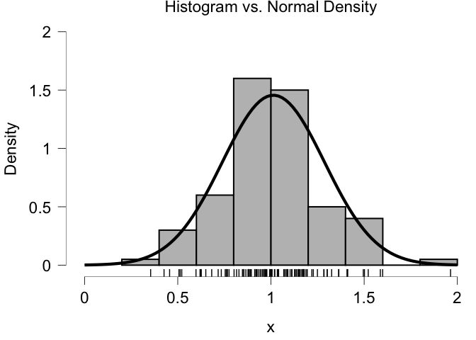
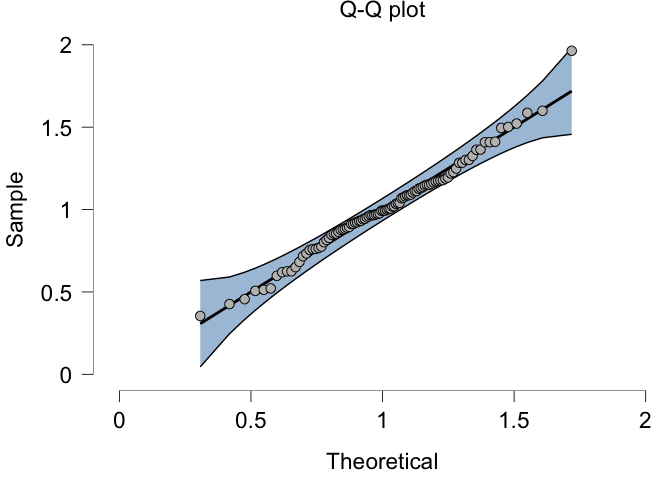

<!-- README.md is generated from README.Rmd. Please edit that file -->

# DistributionS7

<!-- badges: start -->

[](https://github.com/Kucharssim/DistributionS7/actions/workflows/R-CMD-check.yaml)
[](https://app.codecov.io/gh/Kucharssim/DistributionS7)
<!-- badges: end -->

The goal of DistributionS7 is to provide convenient functionality to
work with probability distributions.

## Installation

You can install the development version of DistributionS7 from
[GitHub](https://github.com/) with:

``` r
# renv::install("Kucharssim/DistributionS7")
```

# Example

``` r
library(DistributionS7)
#> 
#> Attaching package: 'DistributionS7'
#> The following objects are masked from 'package:stats':
#> 
#>     Gamma, qf
#> The following object is masked from 'package:grDevices':
#> 
#>     pdf

# create a distribution object
n <- Normal(0, 1)

# sample from a distribution (and distort to make the distribution not fitting well)
x <- rng(n, 100) * 0.3 + 1

# goodness-of-fit tests
gof_test(n, x, estimated=FALSE)
#>              test  statistic      p_value
#> ks_test   ks_test  0.6650199 7.718926e-39
#> cvm_test cvm_test 16.4580581 0.000000e+00
#> ad_test   ad_test 79.5624914 6.000000e-06

# fit to data (maximum likelihood by default)
n <- fit(n, data=x)

# get uncertainty around parameter estimates using normal theory intervals
parameter_inference(n, NormalTheory(), x)
#>         key   label estimate         se     lower     upper
#> mu       mu    \\mu 1.013083 0.02740160 0.9593769 1.0667892
#> sigma sigma \\sigma 0.274016 0.01937584 0.2385541 0.3147494

# fit indices of the fitted distribution
gof_test(n, x, estimated=TRUE)
#>                                      test  statistic   p_value
#> lillie_test                   lillie_test 0.06468284 0.3831233
#> cvm_test                         cvm_test 0.06811919 0.2929871
#> ad_test                           ad_test 0.39604571 0.3642612
#> shapiro_wilk_test       shapiro_wilk_test 0.98592495 0.3694724
#> shapiro_francia_test shapiro_francia_test 0.98307424 0.1966320
information_criteria(n, x)
#>   n_par n_obs   log_lik      aic      bic
#> 1     2   100 -12.43697 28.87394 34.08428

# compare data to distribution
plot_hist(n, x) + ggplot2::ggtitle("Histogram vs. Normal Density")
```



``` r
plot_qq(n, x, ci=TRUE) + ggplot2::ggtitle("Q-Q plot") 
```


